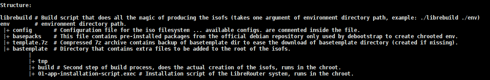

<h3>This directory contains the build environment including the build script for the iso filesystem of LibreRouter.</h3>

<strong>What is a build environment ?</strong>

A build environment is a portable directory that would be used by the build script to produce an iso fs with simple configurations, it contains a configuration file, a file that contains packages to be installed in the iso and a directory that contains extra files to be added to the / of the installed iso filesystem.

<strong>What are the requirements for the build environment and the build script?</strong>

<ol>
<li>Any Debian based GNU/Linux distribution, We recommend Debian Jessie.</li>
<li>Decent internet connection for large packages download.</li>
<li>Enough Free disk space to be used by the work directory.</li>
<li>At least two CPU Cores.</li>
<li>2 GB of Ram</li>
<li>Your OS Architecture should match the iso architecture defined in the configuration file.</li>
<li>root privileges.</li>
</ol>

<strong>How does the build script (librebuild) work in detailed steps?</strong>

<ol>
<li><strong></strong>Read the build environment path as set in the first argument "example: ./librebuild /opt/buildenv/".</li>
<li>If the first argument is missing, the script assumes the build environment resides in "$HOME/.based" where $HOME Is your home directory.</li>
<li>Read configurations from configuration file.</li>
<li>Copy configuration file and base packages file to work directory.</li>
<li>Add kernel package and headers package to base packages file.</li>
<li>Create a temporary&nbsp;work directory that would be used later by debootstrap.</li>
<li>Use debootstrap to acquire default packages from the repository.</li>
<li>Read the defined packages from the basepacks file.</li>
<li>Diff packs and basepacks to get extra included packages and extra packages to remove in order to remove unwanted packages installed by debootstrap to reduce size and memory footprint.</li>
<li>Use debootsrap to build a small chrooted base system with required packages.</li>
<li>Prepare the chrooted base system for our configurations (set hostname and locales)</li>
<li>Apply configurations to work directory (set distro name and initializes installer's parameters)</li>
<li>Copy extra files to be added to / of installed iso filesystem to temporary work directory.</li>
<li>Fix any broken packages.</li>
<li>Generate initramfs</li>
<li>Configure repositories.</li>
<li>Prepare the chroot by bind mounting /proc, /sys, /dev, /dev/pts and copying resolv.conf to chroot directory.</li>
<li>Aquire app-installation-script.sh from the git repository and places it under the /tmp directory of the chroot.</li>
<li>Run app-installation-script.sh inside the chroot jail.</li>
<li>Unmount all mounted filesystem and clean any residual files to keep the isofs clean.</li>
<li>Add isohybrid binary to work directory to make the generated iso bootable from USB disks by BIOS.</li>
<li>Run /tmp/build which compress the chrooted environment into a squashfs and adds the generated kernel image and initramfs image to the iso and finally create an iso file with the squash the kernel and the initramfs.</li>
<li>Generate md5 of the iso file.</li>
<li>Compress the iso file and the md5 file into a single 7zip archive.</li>
<li>Move the 7zip archive to the output path defined in the config file.</li>
</ol>

<strong>How can I run this script and build environment in simple steps, please?</strong>

<ol>
<li>Run: su</li>
<li>Run: apt-get install p7zip-full makepasswd debootstrap coreutils mount wget syslinux-utils</li>
<li>Clone the <strong class="final-path">isobuild</strong>/ directory into your machine.</li>
<li>Change directory to isobuild directory on your machine.</li>
<li>Edit file: env/config to set your configurations (define outdir according to your need).</li>
<li>Run: chmod +x ./librebuild</li>
<li>Run: ./librebuild ./env/</li>
<li>Your 7zip archive containing the iso will be available in the outdir you defined in step 5.</li>
</ol>

<strong>How can I automate the build process?</strong>

Make sure that your environment is set up correctly and add the librebuild script execution in your root crontab file.

<strong>What are the available configurations available in the env/config file?</strong>

<ul>
<li><strong></strong>name - Name of the distribution</li>
<li>base - Name of the OS (basesystem)</li>
<li>ver - Version of the OS (basesystem)</li>
<li>stage - Development Stage (a: alpha, b: beta, rc: release candidate, s: stable)</li>
<li>step - &nbsp;Step of the development stage (3 is 3rd step of the current stage)</li>
<li>codename - Codename to be returned by lsb_release</li>
<li>kver - Kernel version to be installed (should be available in the repository)</li>
<li>website - Website of the distributor</li>
<li>mail - Development Email address of the distributo</li>
<li>bugmail - Bug reporting Email address</li>
<li>size - Minimum size required for the installer to proceed</li>
<li>year - Year of the release</li>
<li>arch - Architecture of the isofs</li>
<li>repo - Main repository to use in order to create the chrooted jail</li>
<li>sourcerepo - Sources repository</li>
<li>workdir - Work directory where the build will occur (should have enough free space)</li>
<li>outdir - Output directory where the isofs will be moved to</li>
</ul>

Structure:

<h3>-- For more information about the installer and the base system refer to horus-docs.pdf file.</h3>
